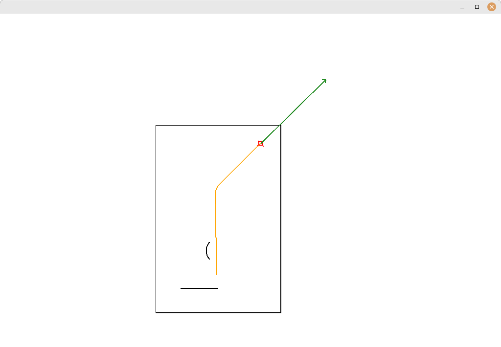

# XViewMap

Lighthouseと互換性のある2Dマップビジュアライザです。

X11ライブラリを使用しています。
macの場合は`brew install libx11`と`brew install --cask xquartz`が必要



マウスでドラッグしてフィールドを動かしたり、スクロールで拡大・縮小ができます

## 使い方1

```bash
mkdir build
cd build
cmake ..
make
make install
```

* `xviewmap`が ~/.robotech/bin にインストールされます
* Lighthouseと同じようにロボットの座標データを流す
```bash
./main | xviewmap
```
* 流すデータの書式は後述
* 後述のxviewmap.tomlファイルを用意するとフィールドやマシンの大きさなどを変更できます

## 使い方2

* 使い方1と同様にxviewmapをインストール
* CまたはC++で
```c++
#include <cstdio>
#include <cstdlib>
FILE *fp;
// 初期化
fp = popen("xviewmap", "w");
// 毎周期実行
fprintf(fp, "0 [FieldMap] %lf %lf %lf %lf %lf %lf\n", x, y, th, vx, vy, omega);
// fprintf(fp, "0 [LocusMap] %lf %lf %lf\n", x, y, th);
```

## 使い方3

* このリポジトリをsubmoduleとして追加する
* CMakeLists.txtでadd_subdirectoryでxviewmapを追加、target_link_librariesに`xviewmap::xviewmap`を追加
* C++で
```c++
#include <xviewmap.hpp>
//初期化で
XViewMap::ViewMap viewmap{};
//毎周期実行
viewmap.updatePos(x, y, th, vx, vy, omega);
```
* これ以外に使える関数の一覧はinclude/xviewmap.hppを確認してください

## xviewmap.toml

* xviewmap.toml というファイルを作成してフィールドやロボットの設定を変更できます
* 実行時のカレントディレクトリまたはその1階層上にxviewmap.tomlファイルがあれば自動で読み込まれます
	* または`xviewmap`の引数にtomlファイルを渡すことでも読み込まれます
* これらの設定は見た目だけであり、シミュレーション結果には影響しません
* 以下は例
```toml
[field]
# フィールドのサイズ
range = [
	[-3000, 3000], # x方向(画面の上が正): -3000mm 〜 +3000mm
	[-3000, 3000]  # y方向(画面の左が正): -3000mm 〜 +3000mm
]
# フィールドの壁などを描く
draw = [
	["line", 0, 0, 500, 500],          # (0, 0) - (500, 500) の直線
	["arc", 0, 0, 500],                # 中心(0, 0) 半径500 の円
	["arc", -500, -500, 300, 90, 270], # 中心(-500, -500) 半径300, 90deg〜270deg方向までの円弧
]

[robot]
# マシンの概形(以下の点を順に繋いだものが表示される)
machine = [
	[150, 150],
	[-150, 150],
	[-150, -150],
	[150, -150],
	[200, 0],
]
# タイヤの位置 [x座標, y座標, 角度(単位はdeg)]
wheel = [
	[200, 200, 135],
	[-200, 200, -135],
	[-200, -200, -45],
	[200, -200, 45],
]
# タイヤの半径
wheel_radius = 50
```

## マシン座標データ

* スペース区切りで
```
0 [FieldMap] x y th vx vy omega
```
を送るとロボットの座標(単位mm, rad)を更新し、オレンジ色で軌跡が、緑色で速度が表示されます
```
0 [LocusMap] x y th
```
を送ると青色で軌跡が表示されます 用途はわからない
* 行頭の0はLighthouseでは時刻を入れる場所ですがXViewMapでは未使用
* これら以外のデータはそのままcoutに流します
